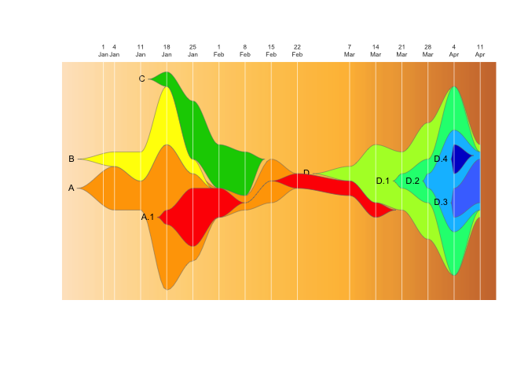
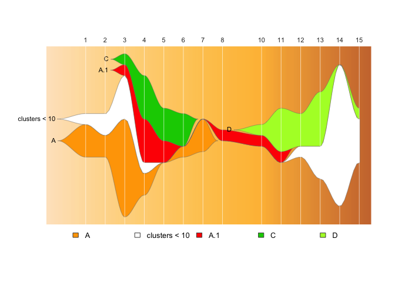
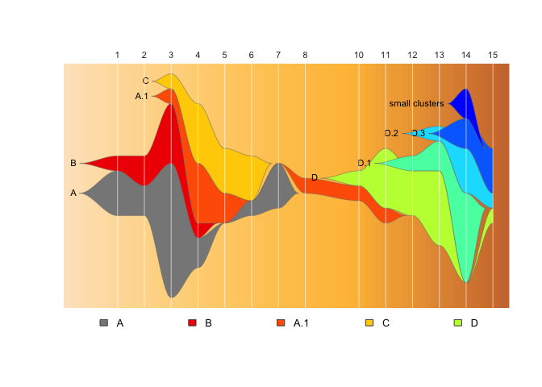

<!-- README.md is generated from README.Rmd. Please edit that file -->

# epifish

<!-- badges: start -->

<!-- badges: end -->

This package provides tools to use Chris Miller’s fishplot package
(<https://github.com/chrisamiller/fishplot>) with epidemiological
datasets, to generate fishplot epi-curves.

## Installation

You can install epifish with:

``` r
#install devtools if you don't have it already for easy installation
install.packages("devtools")
library(devtools)
devtools::install_github("learithe/epifish")
```

## Quick demo

Load epifish and required
packages

``` r
library(fishplot); library(dplyr); library(tidyr); library(lubridate); library(epifish)
```

Read in the tables of sample data, cluster relationships, and a custom
colour
scheme

``` r
sample_df <- read.csv("epifish/inst/extdata/samples.csv", stringsAsFactors=FALSE)
parent_df <- read.csv("epifish/inst/extdata/parents.csv", stringsAsFactors=FALSE)
colour_df <- read.csv("epifish/inst/extdata/colours.csv", stringsAsFactors=FALSE)
```

Convert these into a fishplot-ready relative count matrix, fishplot
object, and assorted summary data
structures:

``` r
fish_list <- epifish::build_fishplot_tables(sample_df, parent_df, colour_df)
#> Padding parent values in matrix: 
#> adding child  D.4  to parent  D.2 
#> adding child  D.3  to parent  D.2 
#> adding child  D.2  to parent  D.1 
#> adding child  D.1  to parent  D 
#> adding child  A.1  to parent  A 
#> The maximum sample count per timepoint (height of Y-axis) is:  15
```

Then use the fishplot package to generate the fishplot
image:

``` r
fishplot::fishPlot(fish_list$fish, pad.left=0.1, shape="spline", vlines=fish_list$timepoints, vlab=fish_list$timepoints)
fishplot::drawLegend(fish_list$fish, nrow=1)
```


Take a look at the underlying matrix and data summaries we generated:

``` r
fish_list$timepoint_counts
#> # A tibble: 34 x 3
#> # Groups:   timepoint [14]
#>    timepoint FPCluster     n
#>        <int> <chr>     <int>
#>  1         1 A             3
#>  2         1 B             1
#>  3         2 A             2
#>  4         2 B             2
#>  5         3 A             9
#>  6         3 A.1           1
#>  7         3 B             4
#>  8         3 C             1
#>  9         4 A             2
#> 10         4 A.1           4
#> # … with 24 more rows

fish_list$timepoint_sums
#> # A tibble: 14 x 2
#>    timepoint     n
#>        <int> <int>
#>  1         1     4
#>  2         2     4
#>  3         3    15
#>  4         4    11
#>  5         5     5
#>  6         6     4
#>  7         7     3
#>  8         8     1
#>  9        10     2
#> 10        11     5
#> 11        12     4
#> 12        13     8
#> 13        14    13
#> 14        15     5

fish_list$cluster_sums
#> # A tibble: 9 x 2
#>   FPCluster     n
#>   <chr>     <int>
#> 1 A             6
#> 2 A.1           6
#> 3 B             4
#> 4 C             4
#> 5 D             5
#> 6 D.1           3
#> 7 D.2           3
#> 8 D.3           2
#> 9 D.4           1

fish_list$parents
#>   A   B A.1   C   D D.1 D.2 D.3 D.4 
#>   0   0   1   0   0   5   6   7   7

fish_list$timepoint_labels
#>  [1] "1"  "2"  "3"  "4"  "5"  "6"  "7"  "8"  "10" "11" "12" "13" "14" "15"

fish_list$raw_table
#>    A B A.1 C D D.1 D.2 D.3 D.4
#> 1  3 1   0 0 0   0   0   0   0
#> 2  2 2   0 0 0   0   0   0   0
#> 3  9 4   1 1 0   0   0   0   0
#> 4  2 1   4 4 0   0   0   0   0
#> 5  0 0   2 3 0   0   0   0   0
#> 6  1 0   0 3 0   0   0   0   0
#> 7  3 0   0 0 0   0   0   0   0
#> 8  0 0   1 0 0   0   0   0   0
#> 10 0 0   1 0 1   0   0   0   0
#> 11 0 0   1 0 4   0   0   0   0
#> 12 0 0   0 0 3   1   0   0   0
#> 13 0 0   0 0 5   2   1   0   0
#> 14 0 0   0 0 0   6   3   2   2
#> 15 0 0   0 0 1   0   1   3   0

fish_list$fish_table
#>          A     B     A.1     C       D   D.1   D.2   D.3   D.4
#> 1  19.7700  6.59  0.0000  0.00  0.0000  0.00  0.00  0.00  0.00
#> 2  13.1800 13.18  0.0000  0.00  0.0000  0.00  0.00  0.00  0.00
#> 3  65.9000 26.36  6.5900  6.59  0.0000  0.00  0.00  0.00  0.00
#> 4  39.5400  6.59 26.3600 26.36  0.0000  0.00  0.00  0.00  0.00
#> 5  13.1801  0.00 13.1800 19.77  0.0000  0.00  0.00  0.00  0.00
#> 6   6.5901  0.00  0.0001 19.77  0.0000  0.00  0.00  0.00  0.00
#> 7  19.7701  0.00  0.0001  0.00  0.0000  0.00  0.00  0.00  0.00
#> 8   6.5900  0.00  6.5900  0.00  0.0000  0.00  0.00  0.00  0.00
#> 10  6.5900  0.00  6.5900  0.00  6.5900  0.00  0.00  0.00  0.00
#> 11  6.5900  0.00  6.5900  0.00 26.3600  0.00  0.00  0.00  0.00
#> 12  0.0000  0.00  0.0000  0.00 26.3600  6.59  0.00  0.00  0.00
#> 13  0.0000  0.00  0.0000  0.00 52.7200 19.77  6.59  0.00  0.00
#> 14  0.0000  0.00  0.0000  0.00 85.6701 85.67 46.13 13.18 13.18
#> 15  0.0000  0.00  0.0000  0.00 32.9500 26.36 26.36 19.77  0.00

fish_list$fish_matrix
#>           1     2     3     4       5       6       7    8   10    11
#>  [1,] 19.77 13.18 65.90 39.54 13.1801  6.5901 19.7701 6.59 6.59  6.59
#>  [2,]  6.59 13.18 26.36  6.59  0.0000  0.0000  0.0000 0.00 0.00  0.00
#>  [3,]  0.00  0.00  6.59 26.36 13.1800  0.0001  0.0001 6.59 6.59  6.59
#>  [4,]  0.00  0.00  6.59 26.36 19.7700 19.7700  0.0000 0.00 0.00  0.00
#>  [5,]  0.00  0.00  0.00  0.00  0.0000  0.0000  0.0000 0.00 6.59 26.36
#>  [6,]  0.00  0.00  0.00  0.00  0.0000  0.0000  0.0000 0.00 0.00  0.00
#>  [7,]  0.00  0.00  0.00  0.00  0.0000  0.0000  0.0000 0.00 0.00  0.00
#>  [8,]  0.00  0.00  0.00  0.00  0.0000  0.0000  0.0000 0.00 0.00  0.00
#>  [9,]  0.00  0.00  0.00  0.00  0.0000  0.0000  0.0000 0.00 0.00  0.00
#>          12    13      14    15
#>  [1,]  0.00  0.00  0.0000  0.00
#>  [2,]  0.00  0.00  0.0000  0.00
#>  [3,]  0.00  0.00  0.0000  0.00
#>  [4,]  0.00  0.00  0.0000  0.00
#>  [5,] 26.36 52.72 85.6701 32.95
#>  [6,]  6.59 19.77 85.6700 26.36
#>  [7,]  0.00  6.59 46.1300 26.36
#>  [8,]  0.00  0.00 13.1800 19.77
#>  [9,]  0.00  0.00 13.1800  0.00
```

## Input

Example input files/templates can be found in the `inst/extdata` folder
in this repository. The basic requirement is a data frame containing one
row per sample, with columns `cluster_id` and `timepoint` (any other
columns are ignored).

Optional data frames may also be provided that describe parent-child
relationships for clusters (eg cluster A.1 evolved from cluster A), or a
custom colour scheme.

A peek at these table structures:

the first few rows of sample data:

<table>

<thead>

<tr>

<th style="text-align:left;">

</th>

<th style="text-align:right;">

case\_id

</th>

<th style="text-align:left;">

cluster\_id

</th>

<th style="text-align:left;">

date\_of\_collection

</th>

<th style="text-align:right;">

timepoint

</th>

</tr>

</thead>

<tbody>

<tr>

<td style="text-align:left;">

79

</td>

<td style="text-align:right;">

80

</td>

<td style="text-align:left;">

D.3

</td>

<td style="text-align:left;">

9/4/2020

</td>

<td style="text-align:right;">

15

</td>

</tr>

<tr>

<td style="text-align:left;">

80

</td>

<td style="text-align:right;">

81

</td>

<td style="text-align:left;">

D.4

</td>

<td style="text-align:left;">

2/4/2020

</td>

<td style="text-align:right;">

14

</td>

</tr>

<tr>

<td style="text-align:left;">

81

</td>

<td style="text-align:right;">

82

</td>

<td style="text-align:left;">

D.4

</td>

<td style="text-align:left;">

2/4/2020

</td>

<td style="text-align:right;">

14

</td>

</tr>

<tr>

<td style="text-align:left;">

82

</td>

<td style="text-align:right;">

83

</td>

<td style="text-align:left;">

D.3

</td>

<td style="text-align:left;">

3/4/2020

</td>

<td style="text-align:right;">

14

</td>

</tr>

<tr>

<td style="text-align:left;">

83

</td>

<td style="text-align:right;">

85

</td>

<td style="text-align:left;">

D.3

</td>

<td style="text-align:left;">

3/4/2020

</td>

<td style="text-align:right;">

14

</td>

</tr>

<tr>

<td style="text-align:left;">

84

</td>

<td style="text-align:right;">

84

</td>

<td style="text-align:left;">

A.1

</td>

<td style="text-align:left;">

22/1/2020

</td>

<td style="text-align:right;">

4

</td>

</tr>

</tbody>

</table>

the parent-child data:

<table>

<thead>

<tr>

<th style="text-align:left;">

cluster

</th>

<th style="text-align:left;">

parent

</th>

</tr>

</thead>

<tbody>

<tr>

<td style="text-align:left;">

A

</td>

<td style="text-align:left;">

NA

</td>

</tr>

<tr>

<td style="text-align:left;">

A.1

</td>

<td style="text-align:left;">

A

</td>

</tr>

<tr>

<td style="text-align:left;">

B

</td>

<td style="text-align:left;">

NA

</td>

</tr>

<tr>

<td style="text-align:left;">

C

</td>

<td style="text-align:left;">

NA

</td>

</tr>

<tr>

<td style="text-align:left;">

D

</td>

<td style="text-align:left;">

NA

</td>

</tr>

<tr>

<td style="text-align:left;">

D.3

</td>

<td style="text-align:left;">

D.2

</td>

</tr>

<tr>

<td style="text-align:left;">

D.2

</td>

<td style="text-align:left;">

D.1

</td>

</tr>

<tr>

<td style="text-align:left;">

D.1

</td>

<td style="text-align:left;">

D

</td>

</tr>

<tr>

<td style="text-align:left;">

D.4

</td>

<td style="text-align:left;">

D.2

</td>

</tr>

</tbody>

</table>

a custom colour scheme:

<table>

<thead>

<tr>

<th style="text-align:left;">

cluster

</th>

<th style="text-align:left;">

colour

</th>

</tr>

</thead>

<tbody>

<tr>

<td style="text-align:left;">

A

</td>

<td style="text-align:left;">

orange

</td>

</tr>

<tr>

<td style="text-align:left;">

A.1

</td>

<td style="text-align:left;">

red

</td>

</tr>

<tr>

<td style="text-align:left;">

B

</td>

<td style="text-align:left;">

yellow

</td>

</tr>

<tr>

<td style="text-align:left;">

C

</td>

<td style="text-align:left;">

green3

</td>

</tr>

<tr>

<td style="text-align:left;">

D

</td>

<td style="text-align:left;">

greenyellow

</td>

</tr>

<tr>

<td style="text-align:left;">

D.1

</td>

<td style="text-align:left;">

springgreen

</td>

</tr>

<tr>

<td style="text-align:left;">

D.2

</td>

<td style="text-align:left;">

deepskyblue

</td>

</tr>

<tr>

<td style="text-align:left;">

D.3

</td>

<td style="text-align:left;">

royalblue1

</td>

</tr>

<tr>

<td style="text-align:left;">

D.4

</td>

<td style="text-align:left;">

blue3

</td>

</tr>

</tbody>

</table>

## Output

The output of epifish is a list variable containing: a fishplot object,
the data structures needed to generate it, and some extra data summary
tables.

This can be used with the fishplot package’s fishPlot() function to
generate an R plot image. If using RStudio, it is most straightforward
to save the R plot as PDF image from the RStudio plot window (Export -\>
“Save as PDF”).

If you wish to save individual tables from the output list for any
reason, it can be done like so:

``` r
write.csv(fish_list$fish_table, "fishplot_table.csv", row.names=FALSE)
```

## Why?

A count matrix for a fishplot has a set of specific rules which an
epidemiological dataset will not naturally fulfil. Namely:  
\* cluster counts can never go completely to zero, if cases reappear
later  
\* if a cluster has a parent/child relationship, at every timepoint the
parent must always have \>= the count of all it’s children.

This package exists to make it easy to convert a list of samples into a
normalised and appropriately “padded” relative count matrix that fulfils
these requirements.

## Extras

### Using raw dates to create timepoints

Epifish also has a few functions to make it easy to convert dates to
CDC-defined epi weeks (to use as timepoints), and generate
label-friendly versions of epi week dates.

*NOTE: when working with dates in both R and Excel, be sure to check
that your values match what you expect\!\!\! When using R for analysis
it is best practice to maintain your data files in a text-based format
like `.csv` (comma-separated-value) format rather than Excel format,
because [Excel has many issues with how it handles
dates](https://datacarpentry.org/spreadsheets-socialsci/03-dates-as-data/),
and using a text-only format avoids having your dates messed up by
Excel.*

``` r
#calculate epiweek timepoints from the column "date_of_collection" & create text labels to match them
sample_df <- sample_df %>% rowwise() %>% 
             mutate("epiweek"= epifish::get_epiweek(cdate = date_of_collection, 
                                                    start_date = "1/1/20", 
                                                    date_format = "dmy"))

#create a timepoint label column that gives the last day of each epi week the sample was collected in:
sample_df <- sample_df %>% rowwise() %>% 
             mutate("timepoint_label"= epifish::get_epiweek_span(cdate = date_of_collection, 
                                                                 return_end = TRUE, 
                                                                 date_format = "dmy")) 

#replace the space in the labels with a newline to look pretty
sample_df <- sample_df %>% rowwise() %>% 
             mutate("timepoint_label"= gsub(" ", "\n", timepoint_label))  
  
#create a "month" column just for fun:
sample_df <- sample_df %>% rowwise() %>% 
             mutate("month"= epifish::get_month(cdate = date_of_collection, 
                                                date_format = "dmy")) 

#look at what we created 
kable( tail(sample_df) )
```

<table>

<thead>

<tr>

<th style="text-align:right;">

case\_id

</th>

<th style="text-align:left;">

cluster\_id

</th>

<th style="text-align:left;">

date\_of\_collection

</th>

<th style="text-align:right;">

timepoint

</th>

<th style="text-align:right;">

epiweek

</th>

<th style="text-align:left;">

timepoint\_label

</th>

<th style="text-align:left;">

month

</th>

</tr>

</thead>

<tbody>

<tr>

<td style="text-align:right;">

80

</td>

<td style="text-align:left;">

D.3

</td>

<td style="text-align:left;">

9/4/2020

</td>

<td style="text-align:right;">

15

</td>

<td style="text-align:right;">

15

</td>

<td style="text-align:left;">

11 Apr

</td>

<td style="text-align:left;">

Apr

</td>

</tr>

<tr>

<td style="text-align:right;">

81

</td>

<td style="text-align:left;">

D.4

</td>

<td style="text-align:left;">

2/4/2020

</td>

<td style="text-align:right;">

14

</td>

<td style="text-align:right;">

14

</td>

<td style="text-align:left;">

4 Apr

</td>

<td style="text-align:left;">

Apr

</td>

</tr>

<tr>

<td style="text-align:right;">

82

</td>

<td style="text-align:left;">

D.4

</td>

<td style="text-align:left;">

2/4/2020

</td>

<td style="text-align:right;">

14

</td>

<td style="text-align:right;">

14

</td>

<td style="text-align:left;">

4 Apr

</td>

<td style="text-align:left;">

Apr

</td>

</tr>

<tr>

<td style="text-align:right;">

83

</td>

<td style="text-align:left;">

D.3

</td>

<td style="text-align:left;">

3/4/2020

</td>

<td style="text-align:right;">

14

</td>

<td style="text-align:right;">

14

</td>

<td style="text-align:left;">

4 Apr

</td>

<td style="text-align:left;">

Apr

</td>

</tr>

<tr>

<td style="text-align:right;">

85

</td>

<td style="text-align:left;">

D.3

</td>

<td style="text-align:left;">

3/4/2020

</td>

<td style="text-align:right;">

14

</td>

<td style="text-align:right;">

14

</td>

<td style="text-align:left;">

4 Apr

</td>

<td style="text-align:left;">

Apr

</td>

</tr>

<tr>

<td style="text-align:right;">

84

</td>

<td style="text-align:left;">

A.1

</td>

<td style="text-align:left;">

22/1/2020

</td>

<td style="text-align:right;">

4

</td>

<td style="text-align:right;">

4

</td>

<td style="text-align:left;">

25 Jan

</td>

<td style="text-align:left;">

Jan

</td>

</tr>

</tbody>

</table>

### Use different timepoint labels

If you call `build_fishplot_tables()` with `timepoint_labels=TRUE`,
epifish will look for a column called “timepoint\_label” to use as the
timepoint labels. *Note: you can only have one unique label per
timepoint value.*

``` r

sample_df$timepoint <- sample_df$epiweek  #fill the "timepoint" column with our  newly calculated epi weeks
fish_list <- epifish::build_fishplot_tables(sample_df, parent_df, colour_df, timepoint_labels=TRUE)
#> Padding parent values in matrix: 
#> adding child  D.4  to parent  D.2 
#> adding child  D.3  to parent  D.2 
#> adding child  D.2  to parent  D.1 
#> adding child  D.1  to parent  D 
#> adding child  A.1  to parent  A 
#> The maximum sample count per timepoint (height of Y-axis) is:  15

fishplot::fishPlot(fish_list$fish, 
                   pad.left=0.1, shape="spline", 
                   vlines=fish_list$timepoints, 
                   vlab=fish_list$timepoint_labels)
fishplot::drawLegend(fish_list$fish, nrow=1)
```


### Specify timepoints and their labels manually

The fishplot package provides flexibility in where to display the
vertical lines and how what to show, which can be used to create custom
combinations rather than using the epifish default:

Say you want to add a “zero” timepoint with the first case, which starts
on the fourth day of the first epi week:

``` r
vlines <- c((3/7), fish_list$timepoints)
vlabs <- c("1\nJan", fish_list$timepoint_labels)

fishplot::fishPlot(fish_list$fish, pad.left=0.1, shape="spline", vlines=vlines, vlab=vlabs)
```


Or use completely custom labels that describe an epidemiological story,
with red lines:

``` r
vlines <- c((3/7), 3, 4, 8, 14)
vlabs <- c("first\ncases", "peak 1", "quarantine\n", "quarantine\nlifted", "peak 2")

fishplot::fishPlot(fish_list$fish, pad.left=0.1, shape="spline", vlines=vlines, vlab=vlabs, col.vline="red")
```



### You can automatically collapse any clusters of a minimum size in to a “small clusters” group:

*Note: at the moment this does not combine well with parent/child
relationships if any child clusters are small\! (A work in
progress…)*

``` r
fish_list <- build_fishplot_tables(sample_df, show_labels=TRUE, min_cluster_size=10)
#> The maximum sample count per timepoint (height of Y-axis) is:  15
fishplot::fishPlot(fish_list$fish, pad.left=0.1, shape="spline", vlines=fish_list$timepoints, vlab=fish_list$timepoints)
fishplot::drawLegend(fish_list$fish, nrow=1)
```



``` r

fish_list <- build_fishplot_tables(sample_df, colour_df=colour_df, show_labels=TRUE, min_cluster_size=5)
#> Warning in set_fish_colours(colour_df, fishplot_names): 
#> WARNING: existing clusters not found in colour list: small clusters
#> Warning in set_fish_colours(colour_df, fishplot_names): 
#> WARNING: some clusters in colour list not found in data: D.4
#> Warning in set_fish_colours(colour_df, fishplot_names): 
#> WARNING: Errors found in colour list; ignoring custom colour palette
#> The maximum sample count per timepoint (height of Y-axis) is:  15
fishplot::fishPlot(fish_list$fish, pad.left=0.1, shape="spline", vlines=fish_list$timepoints, vlab=fish_list$timepoints)
fishplot::drawLegend(fish_list$fish, nrow=1)
```



## Citation:

**If you use epifish in your work, please don’t forget to cite the
fishplot package:**  
Visualizing tumor evolution with the fishplot package for R. Miller CA,
McMichael J, Dang HX, Maher CA, Ding L, Ley TJ, Mardis ER, Wilson RK.
BMC Genomics. <doi:10.1186/s12864-016-3195-z>
