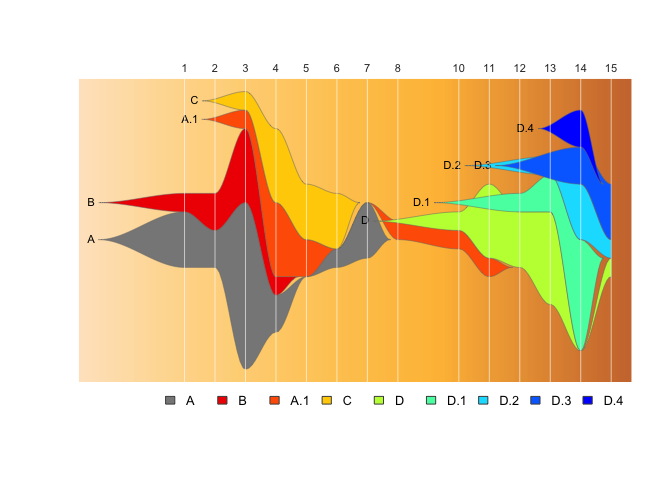
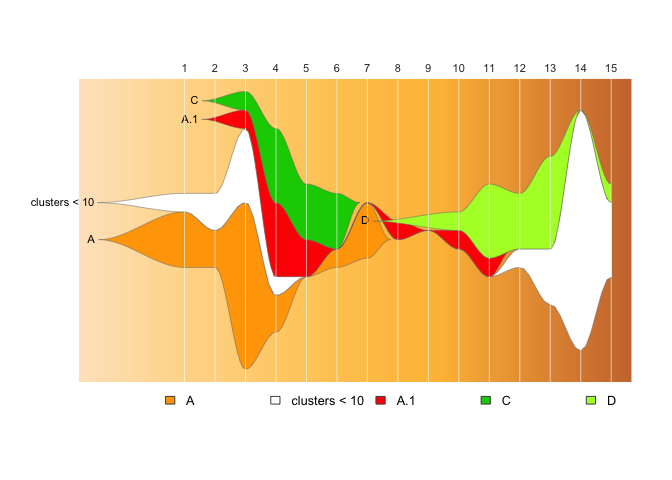
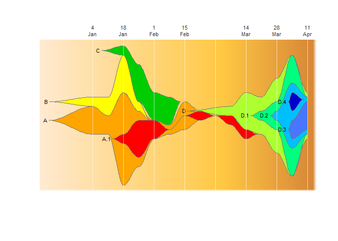
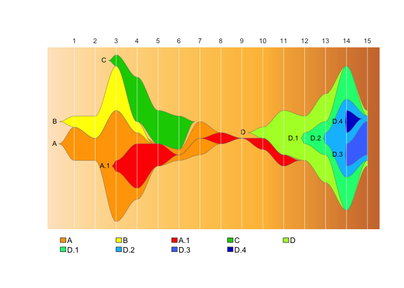
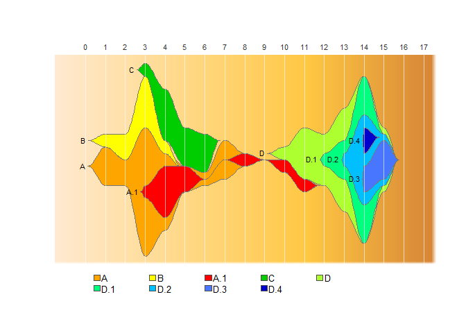
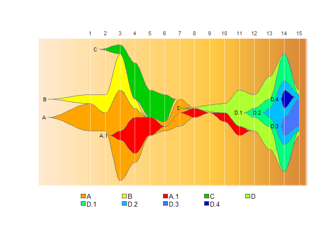
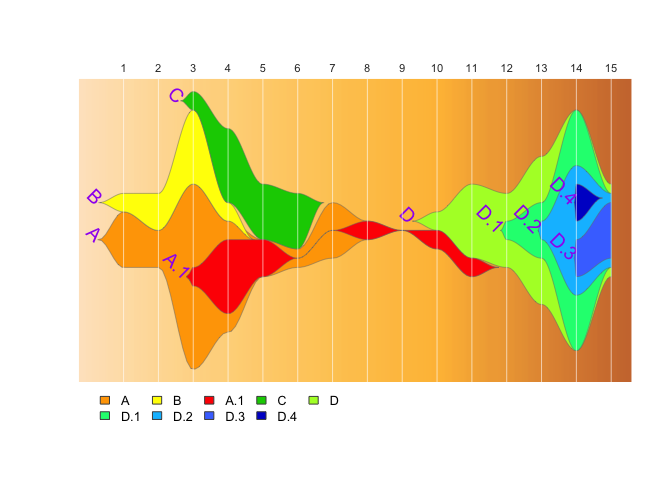
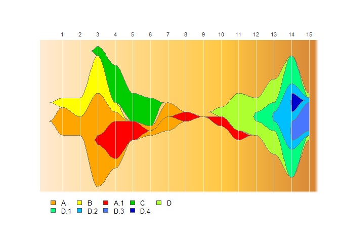
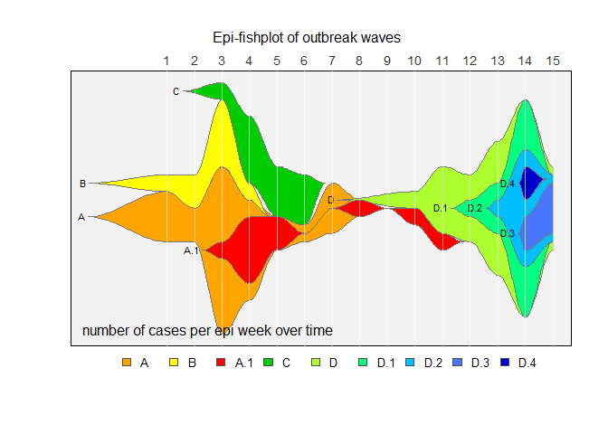

<!-- README.md is generated from README.Rmd. Please edit that file -->

# epifish

<!-- badges: start -->
<!-- badges: end -->

This package provides tools to use Chris Miller’s fishplot package
(<https://github.com/chrisamiller/fishplot>) with epidemiological
datasets, to generate fishplot epi-curves.


**Why?**

A fishplot is variety of [themeriver /
streamgraph](https://www.data-to-viz.com/graph/streamgraph.html), which
is designed specifically for categorical data where where individual
categories can mutate to form subcategories. Originally designed for
[plotting evolution of tumor cell
lineages,](https://bmcgenomics.biomedcentral.com/articles/10.1186/s12864-016-3195-z)
we have found fishplots especially useful for illustrating the rise and
fall of genomic clusters in disease outbreaks, which can have a similar
evolutionary pattern.

However, a count matrix for a fishplot has a set of specific rules which
an epidemiological dataset will not naturally fulfill:

- cluster counts per timepoint can never go completely to zero, if cases
  reappear later
- if a cluster has a parent/child relationship, at every timepoint the
  parent must always have \>= the count of all its children.
- counts should be normalised to fit the fishplot y-axis

This package exists to make it easy to convert a list of samples in an
epidemological dataset into a normalised and appropriately “padded”
relative count matrix that fulfils these requirements.  
<br><br>

## Contents

- [Installation](#installation)
- Usage
  - [Quick start](#quick-start)
  - [Basic demo](#basic-demo)
- Input/Output
  - [Input format](#input-format)
  - [Output](#output)
- Calculate timepoints
  - [Calculate epi weeks](#calculate-epi-weeks-and-text-labels)
  - [Calculate timepoint labels](#calculate-epi-weeks-and-text-labels)
  - [Calculate epi months](#calculate-epi-months)
- Using informative timepoint labels
  - [Using timepoint labels](#using-informative-timepoint-labels)
  - [Plot every other week](#plot-every-other-week)
  - [Add extra timepoint
    lines](#add-extra-timepoint-lines-not-present-in-the-data)
  - [Use completely manual timepoint lines and
    labels](#use-completely-manual-timepoint-lines-and-labels)
- Controlling appearance
  - [Control how far back in time clusters
    appear](#control-how-far-back-in-time-clusters-appear)
  - [Add extra start or end
    timepoints](#add-extra-start-or-end-timepoints)
  - [Control legend spacing](#control-legend-spacing)
  - [Change cluster label appearance](#change-cluster-label-appearance)
  - [Don’t show cluster labels](#dont-show-cluster-labels)
  - [Change fishplot titles and
    background](#change-fishplot-titles-and-background)
- [Citation](#citation)
- [Acknowledgements](#acknowledgements)

## Installation

You can install epifish with:

``` r
#install devtools if you don't have it already
install.packages("devtools")
library(devtools)

#install epifish
devtools::install_github("learithe/epifish")
```

## Quick Start

To get started with a basic epi fishplot, given an input file in the
right format (details below), this is all you need:

``` r
# load required libraries
library(fishplot); library(epifish)
#> Using fishPlot version 0.5.1

# read data file
sample_df <- read.csv(system.file("extdata/samples.csv", package = "epifish"), stringsAsFactors=FALSE)

# run epifish
epifish_output <- build_epifish( sample_df )
#> Checking for missing timepoints: 
#>  - Adding zero counts for missing timepoint: 9
#> The maximum sample count per timepoint (height of Y-axis) is:  15

# run fishplot on the epifish output
fishplot::fishPlot( epifish_output$fish, shape="spline" )  
```


**If you want to include evolutionary relationships with subclusters:**

``` r
# load required libraries
library(fishplot); library(epifish)

# read data files
sample_df <- read.csv(system.file("extdata/samples.csv", package = "epifish"), stringsAsFactors=FALSE)
parent_df <- read.csv(system.file("extdata/parents.csv", package = "epifish"), stringsAsFactors=FALSE)

# run epifish
epifish_output <- build_epifish( sample_df, parent_df )
#> Checking for missing timepoints: 
#>  - Adding zero counts for missing timepoint: 9
#> setting parent position of child A.1  to  1 
#> setting parent position of child D.3  to  7 
#> setting parent position of child D.2  to  6 
#> setting parent position of child D.1  to  5 
#> setting parent position of child D.4  to  7 
#> Padding parent values in matrix: 
#> adding child  D.4  to parent  D.2 
#> adding child  D.3  to parent  D.2 
#> adding child  D.2  to parent  D.1 
#> adding child  D.1  to parent  D 
#> adding child  A.1  to parent  A 
#> The maximum sample count per timepoint (height of Y-axis) is:  15

# run fishplot on the epifish output
fishPlot( epifish_output$fish, shape="spline" )  
```


## Basic demo

*This demo expands on the quick-start example. It runs on a made-up set
of example data that can be accessed here, in the
[`inst/extdata`](inst/extdata) directory.* <br><br>

Load epifish and required packages

``` r
library(fishplot); library(epifish)
```

Read in the tables of sample data, cluster parent-child relationships,
and custom colour scheme:

``` r
sample_df <- read.csv(system.file("extdata/samples.csv", package = "epifish"), stringsAsFactors=FALSE)
parent_df <- read.csv(system.file("extdata/parents.csv", package = "epifish"), stringsAsFactors=FALSE)
colour_df <- read.csv(system.file("extdata/colours.csv", package = "epifish"), stringsAsFactors=FALSE)
```

Use epifish to convert this into a fishplot object, with extra assorted
summary information:

``` r
epifish_output <- build_epifish( sample_df, parent_df=parent_df, colour_df=colour_df, add_missing_timepoints=TRUE)
#> Checking for missing timepoints: 
#>  - Adding zero counts for missing timepoint: 9
#> setting parent position of child A.1  to  1 
#> setting parent position of child D.3  to  7 
#> setting parent position of child D.2  to  6 
#> setting parent position of child D.1  to  5 
#> setting parent position of child D.4  to  7 
#> Padding parent values in matrix: 
#> adding child  D.4  to parent  D.2 
#> adding child  D.3  to parent  D.2 
#> adding child  D.2  to parent  D.1 
#> adding child  D.1  to parent  D 
#> adding child  A.1  to parent  A 
#> The maximum sample count per timepoint (height of Y-axis) is:  15
```

Then use the fishplot package to generate a fishplot:

``` r
fishPlot(epifish_output$fish, shape="spline",
         vlines=epifish_output$timepoints, vlab=epifish_output$timepoints)
drawLegend(epifish_output$fish, nrow=1)
```


If you’re happy with the default colours, or all your clusters are
independent, you don’t need those dataframes:

``` r
epifish_output <- build_epifish( sample_df )
#> Checking for missing timepoints: 
#>  - Adding zero counts for missing timepoint: 9
#> The maximum sample count per timepoint (height of Y-axis) is:  15

fishPlot(epifish_output$fish, shape="spline",
         vlines=epifish_output$timepoints, vlab=epifish_output$timepoints)
drawLegend(epifish_output$fish, nrow=1)
```



You also can automatically collapse any clusters of a minimum size into
a group with `min_cluster_size`:  
*Note: this currently does not work well with parent/child relationships
if any child clusters are small!*

``` r
epifish_output <- build_epifish(sample_df, colour_df=colour_df, min_cluster_size=10)
#> Checking for missing timepoints: 
#>  - Adding zero counts for missing timepoint: 9
#> Warning in set_fish_colours(colour_df, fishplot_names): 
#> WARNING: existing clusters not found in colour list, setting these to white: clusters < 10
#> Warning in set_fish_colours(colour_df, fishplot_names): 
#> WARNING: some clusters in colour list not found in data: B, D.1, D.2, D.3, D.4
#> The maximum sample count per timepoint (height of Y-axis) is:  15

fishPlot(epifish_output$fish, shape="spline", vlines=epifish_output$timepoints, vlab=epifish_output$timepoints)
drawLegend(epifish_output$fish, nrow=1)
```



## Input format

Example input files/templates can be found in the `inst/extdata` folder
or with `system.file(..., package = "epifish")`. The basic requirement
is a data frame containing one row per sample, with columns `cluster_id`
and `timepoint` (any other columns are ignored). Optionally, the
`timepoint` column can be calculated using epifish from a column of
dates (see below).

Optional data frames may also be provided that describe parent-child
relationships for clusters (eg cluster A.1 evolved from cluster A), or a
custom colour scheme.

It is easiest and safest (especially when working with dates) to save
and maintain these tables in `.csv` (comma-separated values) format, and
to read them into R using `read.csv("filename", stringsAsFactors=FALSE)`
as shown in the example above. However you can use whatever methods you
want to create these dataframes, as long as they contain the required
columns in character or numeric (NOT factor) format.

**the last few rows of sample data:**  
(Note that the order doesn’t matter)

| case_id | cluster_id | date_of_collection | timepoint |
|--------:|:-----------|:-------------------|----------:|
|      80 | D.3        | 9/4/2020           |        15 |
|      81 | D.4        | 2/4/2020           |        14 |
|      82 | D.4        | 2/4/2020           |        14 |
|      83 | D.3        | 3/4/2020           |        14 |
|      85 | D.3        | 3/4/2020           |        14 |
|      84 | A.1        | 22/1/2020          |         4 |

**the parent-child data:**

| cluster | parent |
|:--------|:-------|
| A       |        |
| A.1     | A      |
| B       |        |
| C       |        |
| D       |        |
| D.3     | D.2    |
| D.2     | D.1    |
| D.1     | D      |
| D.4     | D.2    |

**a custom colour scheme:**  
(Note that you can use [named ggplot
colours](https://www.nceas.ucsb.edu/sites/default/files/2020-04/colorPaletteCheatsheet.pdf)
or hex codes (eg “red” or “\#ff0000”) )

| cluster | colour      |
|:--------|:------------|
| A       | orange      |
| A.1     | red         |
| B       | yellow      |
| C       | green3      |
| D       | greenyellow |
| D.1     | springgreen |
| D.2     | deepskyblue |
| D.3     | royalblue1  |
| D.4     | blue3       |

## Output

The output of epifish is a list variable (named `epifish_output` here)
containing: a fishplot object (`epifish_output$fish`), the data
structures needed to generate it, and some extra data summary tables:

- `fish` fishplot object to pass to `fishplot::fishPlot()`
- `timepoint_counts` summary table of number of samples per cluster per
  timepoint
- `timepoint_sums` summary table of number of samples per timepoint
- `cluster_sums` summary table of total number of samples per cluster
- `timepoints` vector of timepoints used
- `timepoint_labels` vector of the names of timepoints assigned in the
  plot
- `parents` named list matching child clusters to their parent’s
  position in the matrix (0 means cluster is independent)
- `raw_table` initial table of counts per cluster per timepoint, before
  padding and normalisation
- `fish_table` normalised and parent-padded table for the epi-fishplot
- `fish_matrix` final transformed matrix used to make the epifish object

The epifish fishplot object output `epifish_output$fish` is used with
the fishplot package’s `fishPlot()` function to generate an R plot
image, as shown above. If using RStudio, it is most straightforward to
save the R plot as PDF image from the RStudio plot window (Export -\>
“Save as PDF”).

If you wish to save individual tables from the epifish output list for
any reason, it can be done like so:

``` r
write.csv(epifish_output$fish_table, "epifishplot_table.csv", row.names=FALSE)
```

This is the extra summary data that epifish creates:

``` r
# total cases per cluster per timepoint
print( as.data.frame(epifish_output$timepoint_counts), row.names=FALSE )
#>  timepoint FPCluster n
#>          1         A 3
#>          1         B 1
#>          2         A 2
#>          2         B 2
#>          3         A 9
#>          3       A.1 1
#>          3         B 4
#>          3         C 1
#>          4         A 2
#>          4       A.1 4
#>          4         B 1
#>          4         C 4
#>          5       A.1 2
#>          5         C 3
#>          6         A 1
#>          6         C 3
#>          7         A 3
#>          8       A.1 1
#>          9         A 0
#>          9         B 0
#>          9       A.1 0
#>          9         C 0
#>          9         D 0
#>          9       D.1 0
#>          9       D.2 0
#>          9       D.3 0
#>          9       D.4 0
#>         10       A.1 1
#>         10         D 1
#>         11       A.1 1
#>         11         D 4
#>         12         D 3
#>         12       D.1 1
#>         13         D 5
#>         13       D.1 2
#>         13       D.2 1
#>         14       D.1 6
#>         14       D.2 3
#>         14       D.3 2
#>         14       D.4 2
#>         15         D 1
#>         15       D.2 1
#>         15       D.3 3

# total cases per timepoint
print( as.data.frame(epifish_output$timepoint_sums), row.names=FALSE )
#>  timepoint  n
#>          1  4
#>          2  4
#>          3 15
#>          4 11
#>          5  5
#>          6  4
#>          7  3
#>          8  1
#>          9  0
#>         10  2
#>         11  5
#>         12  4
#>         13  8
#>         14 13
#>         15  5

# total cases per cluster
print( as.data.frame(epifish_output$cluster_sums), row.names=FALSE )
#>  FPCluster n
#>          A 7
#>        A.1 7
#>          B 5
#>          C 5
#>          D 6
#>        D.1 4
#>        D.2 4
#>        D.3 3
#>        D.4 2

# parent relationship table
print( epifish_output$parents )
#>   A   B A.1   C   D D.1 D.2 D.3 D.4 
#>   0   0   1   0   0   5   6   7   7

# list of timepoints to display
print( epifish_output$timepoints )
#>  1  2  3  4  5  6  7  8  9 10 11 12 13 14 15 
#>  1  2  3  4  5  6  7  8  9 10 11 12 13 14 15

# list of labels for each timepoint
print( epifish_output$timepoint_labels )
#>  [1] "1"  "2"  "3"  "4"  "5"  "6"  "7"  "8"  "9"  "10" "11" "12" "13" "14" "15"

# raw count table
print( epifish_output$raw_table )
#>    A B A.1 C D D.1 D.2 D.3 D.4
#> 1  3 1   0 0 0   0   0   0   0
#> 2  2 2   0 0 0   0   0   0   0
#> 3  9 4   1 1 0   0   0   0   0
#> 4  2 1   4 4 0   0   0   0   0
#> 5  0 0   2 3 0   0   0   0   0
#> 6  1 0   0 3 0   0   0   0   0
#> 7  3 0   0 0 0   0   0   0   0
#> 8  0 0   1 0 0   0   0   0   0
#> 9  0 0   0 0 0   0   0   0   0
#> 10 0 0   1 0 1   0   0   0   0
#> 11 0 0   1 0 4   0   0   0   0
#> 12 0 0   0 0 3   1   0   0   0
#> 13 0 0   0 0 5   2   1   0   0
#> 14 0 0   0 0 0   6   3   2   2
#> 15 0 0   0 0 1   0   1   3   0

# normalised and padded count table
print( epifish_output$fish_table )
#>           A     B     A.1     C        D      D.1   D.2   D.3   D.4
#> 1  19.77000  6.59  0.0000  0.00  0.00000  0.00000  0.00  0.00  0.00
#> 2  13.18000 13.18  0.0000  0.00  0.00000  0.00000  0.00  0.00  0.00
#> 3  65.90000 26.36  6.5900  6.59  0.00000  0.00000  0.00  0.00  0.00
#> 4  39.54000  6.59 26.3600 26.36  0.00000  0.00000  0.00  0.00  0.00
#> 5  13.18010  0.00 13.1800 19.77  0.00000  0.00000  0.00  0.00  0.00
#> 6   6.59010  0.00  0.0001 19.77  0.00000  0.00000  0.00  0.00  0.00
#> 7  19.77010  0.00  0.0001  0.00  0.00000  0.00000  0.00  0.00  0.00
#> 8   6.59001  0.00  6.5900  0.00  0.00000  0.00000  0.00  0.00  0.00
#> 9   0.00011  0.00  0.0001  0.00  0.00000  0.00000  0.00  0.00  0.00
#> 10  6.59001  0.00  6.5900  0.00  6.59000  0.00000  0.00  0.00  0.00
#> 11  6.59001  0.00  6.5900  0.00 26.36000  0.00000  0.00  0.00  0.00
#> 12  0.00000  0.00  0.0000  0.00 26.36000  6.59000  0.00  0.00  0.00
#> 13  0.00000  0.00  0.0000  0.00 52.72000 19.77000  6.59  0.00  0.00
#> 14  0.00000  0.00  0.0000  0.00 85.67010 85.67000 46.13 13.18 13.18
#> 15  0.00000  0.00  0.0000  0.00 32.95001 26.36001 26.36 19.77  0.00

# rotated final matrix used to generate the epifish fishplot object
print( epifish_output$fish_matrix )
#>           1     2     3     4       5       6       7       8       9      10
#>  [1,] 19.77 13.18 65.90 39.54 13.1801  6.5901 19.7701 6.59001 0.00011 6.59001
#>  [2,]  6.59 13.18 26.36  6.59  0.0000  0.0000  0.0000 0.00000 0.00000 0.00000
#>  [3,]  0.00  0.00  6.59 26.36 13.1800  0.0001  0.0001 6.59000 0.00010 6.59000
#>  [4,]  0.00  0.00  6.59 26.36 19.7700 19.7700  0.0000 0.00000 0.00000 0.00000
#>  [5,]  0.00  0.00  0.00  0.00  0.0000  0.0000  0.0000 0.00000 0.00000 6.59000
#>  [6,]  0.00  0.00  0.00  0.00  0.0000  0.0000  0.0000 0.00000 0.00000 0.00000
#>  [7,]  0.00  0.00  0.00  0.00  0.0000  0.0000  0.0000 0.00000 0.00000 0.00000
#>  [8,]  0.00  0.00  0.00  0.00  0.0000  0.0000  0.0000 0.00000 0.00000 0.00000
#>  [9,]  0.00  0.00  0.00  0.00  0.0000  0.0000  0.0000 0.00000 0.00000 0.00000
#>             11    12    13      14       15
#>  [1,]  6.59001  0.00  0.00  0.0000  0.00000
#>  [2,]  0.00000  0.00  0.00  0.0000  0.00000
#>  [3,]  6.59000  0.00  0.00  0.0000  0.00000
#>  [4,]  0.00000  0.00  0.00  0.0000  0.00000
#>  [5,] 26.36000 26.36 52.72 85.6701 32.95001
#>  [6,]  0.00000  6.59 19.77 85.6700 26.36001
#>  [7,]  0.00000  0.00  6.59 46.1300 26.36000
#>  [8,]  0.00000  0.00  0.00 13.1800 19.77000
#>  [9,]  0.00000  0.00  0.00 13.1800  0.00000
```

## Calculate timepoints

Epifish also has a few functions to make it easy to convert dates to
epidemic weeks or months (to use as timepoints), and generate
label-friendly versions of timepoint dates.

*NOTE: when working with dates in both R and Excel, be sure to check
that your values match what you expect! When using R for analysis it is
best practice to save your data files in a text-based format like `.csv`
(comma-separated-value) format rather than Excel format, because [Excel
has many issues with how it handles
dates](https://datacarpentry.org/spreadsheets-socialsci/03-dates-as-data/),
and using a text-only format avoids having your dates messed up by
Excel.*

#### Calculate epi weeks and text labels

Given a date column name (`date_of_collection` here), the start date of
the epidemic, and the date format, you can use `get_epiweek()` to
calculate the number of weeks since the start of the epidemic each
sample belongs to, and `get_epiweek_span()` to give the epi week a clear
text label. *Note: these functions have customisation options for
different date/range formats; check their documentation for details.*

``` r
library(dplyr)

#calculate epiweek timepoints from the column "date_of_collection" & create text labels to match them
sample_df <- sample_df %>%
             rowwise() %>%
             mutate("epiweek"= get_epiweek(cdate = date_of_collection,
                                           start_date = "1/1/20",
                                           date_format = "dmy"))

#create a timepoint label column that gives the last day of each epi week the sample was collected in:
sample_df <- sample_df %>%
             rowwise() %>%
             mutate("epiweek_label"= get_epiweek_span(cdate = date_of_collection,
                                                      date_format = "dmy",
                                                      return_end = TRUE,
                                                      newline=TRUE))
```

``` r
#peek at what we created
tail(sample_df)
```

| case_id | cluster_id | date_of_collection | timepoint | epiweek | epiweek_label |
|--------:|:-----------|:-------------------|----------:|--------:|:--------------|
|      80 | D.3        | 9/4/2020           |        15 |      15 | 11 Apr        |
|      81 | D.4        | 2/4/2020           |        14 |      14 | 4 Apr         |
|      82 | D.4        | 2/4/2020           |        14 |      14 | 4 Apr         |
|      83 | D.3        | 3/4/2020           |        14 |      14 | 4 Apr         |
|      85 | D.3        | 3/4/2020           |        14 |      14 | 4 Apr         |
|      84 | A.1        | 22/1/2020          |         4 |       4 | 25 Jan        |

<br>

#### Calculate epi months:

Epifish also has `get_epimonth()` and `get_month_text()` functions for
calculating epi months from dates:

``` r
#create a "epimonth" timepoint:
sample_df <- sample_df %>% rowwise() %>%
             mutate("epimonth"= get_epimonth(cdate = date_of_collection,
                                             start_date = "1/1/20",
                                             date_format = "dmy"))
#and an epimonth label
sample_df <- sample_df %>% rowwise() %>%
             mutate("epimonth_label"= get_month_text(cdate = date_of_collection,
                                                     date_format = "dmy"))
```

``` r
#peek at what we created
tail(sample_df)
```

| case_id | cluster_id | date_of_collection | timepoint | epiweek | epiweek_label | epimonth | epimonth_label |
|--------:|:-----------|:-------------------|----------:|--------:|:--------------|---------:|:---------------|
|      80 | D.3        | 9/4/2020           |        15 |      15 | 11 Apr        |        4 | Apr            |
|      81 | D.4        | 2/4/2020           |        14 |      14 | 4 Apr         |        4 | Apr            |
|      82 | D.4        | 2/4/2020           |        14 |      14 | 4 Apr         |        4 | Apr            |
|      83 | D.3        | 3/4/2020           |        14 |      14 | 4 Apr         |        4 | Apr            |
|      85 | D.3        | 3/4/2020           |        14 |      14 | 4 Apr         |        4 | Apr            |
|      84 | A.1        | 22/1/2020          |         4 |       4 | 25 Jan        |        1 | Jan            |

## Using informative timepoint labels

If you call `build_epifish ()` with `timepoint_labels=TRUE`, epifish
will look for a column called `timepoint_label` to use as the timepoint
labels. You can set this up as a column in your input file by hand, or
you can calculate it from dates as shown above.) *Note: you can only
have one unique label per timepoint value.*

``` r
#to use the epiweeks and epiweek labels we calculated above, we need to set these as columns named "timepoint" and "timepoint_label" in the sample dataframe:
sample_df$timepoint <- sample_df$epiweek  
sample_df$timepoint_label <- sample_df$epiweek_label

#then generate the epifish object, specifying that you want to use timepoint labels
epifish_output <- build_epifish( sample_df, parent_df, colour_df, timepoint_labels=TRUE)
#> Checking for missing timepoints: 
#>  - Adding zero counts for missing timepoint: 9
#> setting parent position of child A.1  to  1 
#> setting parent position of child D.3  to  7 
#> setting parent position of child D.2  to  6 
#> setting parent position of child D.1  to  5 
#> setting parent position of child D.4  to  7 
#> Padding parent values in matrix: 
#> adding child  D.4  to parent  D.2 
#> adding child  D.3  to parent  D.2 
#> adding child  D.2  to parent  D.1 
#> adding child  D.1  to parent  D 
#> adding child  A.1  to parent  A 
#> The maximum sample count per timepoint (height of Y-axis) is:  15

#and draw the fishplot
fishPlot(epifish_output$fish, shape="spline",
         vlines=epifish_output$timepoints, vlab=epifish_output$timepoint_labels)
drawLegend(epifish_output$fish, nrow=1)
```


The fishplot package provides further flexibility in where to display
the vertical lines and what text to show, which can be used to create
custom combinations rather than using the epifish defaults:

#### Plot every other week:

If things are getting crowded, you can label just every other week:

``` r
#subset timepoints and labels to ever other entry
vlines <- epifish_output$timepoints[c(TRUE, FALSE)]
vlabs  <- epifish_output$timepoint_labels[c(TRUE, FALSE)]

fishPlot(epifish_output$fish, shape="spline", vlines=vlines, vlab=vlabs)
```



#### Add extra timepoint lines not present in the data

Or add a “zero” timepoint with the first case, which starts on the
fourth day of the first epi week (we’ll also make the text a bit smaller
so it doesn’t overlap):

``` r
vlines <- c((4/7), epifish_output$timepoints)
vlabs <- c("1\nJan", epifish_output$timepoint_labels)

fishPlot(epifish_output$fish, shape="spline",
         vlines=vlines, vlab=vlabs, cex.vlab=0.5)
```


#### Use completely manual timepoint lines and labels

We can specify completely custom timepoints and labels that describe an
epidemiological story, with red lines:

``` r
vlines <- c((4/7), 3, 8.5, 14)
vlabs <- c("first\ncases", "wave 1", "quarantine\nbreach", "wave 2")

fishPlot(epifish_output$fish, shape="spline",
         vlines=vlines, vlab=vlabs, col.vline="red")
```


## Controlling appearance

### Control how far back in time clusters appear

You can modify how far back in time the clusters seem to “begin” using
the `pad_left` argument to `fishplot::fishPlot()`:

``` r
fishPlot(epifish_output$fish, shape="spline", vlines=epifish_output$timepoints, vlab=epifish_output$timepoint_labels,  pad.left=0.05)
drawLegend(epifish_output$fish, nrow=2, widthratio=0.3, xsp=0.2)
```



### Add extra start or end timepoints

You can add extra “padding” timepoints to the start and end of the data
using the `start_time` and `end_time` arguments of
`epifish::build_epifish`:

``` r
epifish_output <- build_epifish (sample_df, parent_df, colour_df, start_time = 0, end_time = 17)
#> Checking for missing timepoints: 
#>  - Adding zero counts for missing timepoint: 0
#>  - Adding zero counts for missing timepoint: 9
#>  - Adding zero counts for missing timepoint: 16
#>  - Adding zero counts for missing timepoint: 17
#> setting parent position of child A.1  to  1 
#> setting parent position of child D.3  to  7 
#> setting parent position of child D.2  to  6 
#> setting parent position of child D.1  to  5 
#> setting parent position of child D.4  to  7 
#> Padding parent values in matrix: 
#> adding child  D.4  to parent  D.2 
#> adding child  D.3  to parent  D.2 
#> adding child  D.2  to parent  D.1 
#> adding child  D.1  to parent  D 
#> adding child  A.1  to parent  A 
#> The maximum sample count per timepoint (height of Y-axis) is:  15

fishPlot(epifish_output$fish, shape="spline", vlines=epifish_output$timepoints, vlab=epifish_output$timepoint_labels,  pad.left=0.05)
drawLegend(epifish_output$fish, nrow=2, widthratio=0.3, xsp=0.2)
```



### Control legend spacing

Using fishplot v0.5.1+, you can modify the spacing of the epi-fishplot
legend, which is especially useful with long cluster names. Use
`widthratio` to adjust the width between columns relative to the longest
cluster name (smaller value = more space), and `xsp` to control space
between the colour box and the text (larger = more space)

``` r
fishPlot(epifish_output$fish, shape="spline", vlines=epifish_output$timepoints, vlab=epifish_output$timepoint_labels)
drawLegend(epifish_output$fish, nrow=2, widthratio=0.3, xsp=0.2)
```



### Change cluster label appearance

Using fishplot v0.5.1+, you can modify the size, colour, position, and
angle of cluster labels when building fishplot objects. You can set
these values using arguments to `epifish::build_epifish()`.

``` r
epifish_output <- build_epifish(sample_df, parent_df, colour_df,
                                label_col = "purple",
                                label_angle = -45,
                                label_cex = 1.2,
                                label_pos=2,
                                label_offset=0.05)
#> Checking for missing timepoints: 
#>  - Adding zero counts for missing timepoint: 9
#> setting parent position of child A.1  to  1 
#> setting parent position of child D.3  to  7 
#> setting parent position of child D.2  to  6 
#> setting parent position of child D.1  to  5 
#> setting parent position of child D.4  to  7 
#> Padding parent values in matrix: 
#> adding child  D.4  to parent  D.2 
#> adding child  D.3  to parent  D.2 
#> adding child  D.2  to parent  D.1 
#> adding child  D.1  to parent  D 
#> adding child  A.1  to parent  A 
#> The maximum sample count per timepoint (height of Y-axis) is:  15
fishPlot(epifish_output$fish, shape="spline", vlines=epifish_output$timepoints, vlab=epifish_output$timepoint_labels,  pad.left=0.05)
drawLegend(epifish_output$fish)
```



### Don’t show cluster labels

If you don’t want to show the cluster labels on the fishplot, set
`label_clusters=FALSE` in `epifish::build_epifish()`.

``` r
epifish_output <- build_epifish (sample_df, parent_df, colour_df, label_clusters=FALSE)
#> Checking for missing timepoints: 
#>  - Adding zero counts for missing timepoint: 9
#> setting parent position of child A.1  to  1 
#> setting parent position of child D.3  to  7 
#> setting parent position of child D.2  to  6 
#> setting parent position of child D.1  to  5 
#> setting parent position of child D.4  to  7 
#> Padding parent values in matrix: 
#> adding child  D.4  to parent  D.2 
#> adding child  D.3  to parent  D.2 
#> adding child  D.2  to parent  D.1 
#> adding child  D.1  to parent  D 
#> adding child  A.1  to parent  A 
#> The maximum sample count per timepoint (height of Y-axis) is:  15

fishPlot(epifish_output$fish, shape="spline", vlines=epifish_output$timepoints, vlab=epifish_output$timepoint_labels,  pad.left=0.05)
drawLegend(epifish_output$fish)
```



### Change fishplot titles and background

You can also adjust assorted aspects of the fishplot as arguments to
`fishplot::fishPlot()`. For details, refer to the documentation for the
fishplot package (try the command `?fishplot::fishPlot`).

``` r
epifish_output <- build_epifish(sample_df, parent_df, colour_df)
#> Checking for missing timepoints: 
#>  - Adding zero counts for missing timepoint: 9
#> setting parent position of child A.1  to  1 
#> setting parent position of child D.3  to  7 
#> setting parent position of child D.2  to  6 
#> setting parent position of child D.1  to  5 
#> setting parent position of child D.4  to  7 
#> Padding parent values in matrix: 
#> adding child  D.4  to parent  D.2 
#> adding child  D.3  to parent  D.2 
#> adding child  D.2  to parent  D.1 
#> adding child  D.1  to parent  D 
#> adding child  A.1  to parent  A 
#> The maximum sample count per timepoint (height of Y-axis) is:  15
fishPlot(epifish_output$fish, shape="spline",
         vlines=epifish_output$timepoints,
         vlab=epifish_output$timepoint_labels,
         pad.left=0.2,
         cex.vlab=0.85,
         title="Epi-fishplot of outbreak waves",
         title.btm="number of cases per epi week over time",
         cex.title=1,
         bg.type="solid",
         bg.col="grey95")
#> [1] "WARNING: there were not 3 background gradient colors set - falling back to defaults"
drawLegend(epifish_output$fish, nrow=1, xpos=-1)
```



## Citation:

**If you use epifish in your work, please cite:**

- **epifish**: Documenting elimination of co-circulating COVID-19
  clusters using genomics in New South Wales, Australia. Arnott A,
  Draper J et al. BMC Research Notes.
  [10.1186/s13104-021-05827-x](https://bmcresnotes.biomedcentral.com/articles/10.1186/s13104-021-05827-x)
- **fishplot**: Visualizing tumor evolution with the fishplot package
  for R. Miller CA, McMichael J, Dang HX, Maher CA, Ding L, Ley TJ,
  Mardis ER, Wilson RK. BMC Genomics.
  [doi:10.1186/s12864-016-3195-z](https://bmcgenomics.biomedcentral.com/articles/10.1186/s12864-016-3195-z)

See also:

``` r
citation("epifish")
```

<br>

## Acknowledgements:

This work extends the Chris Miller’s fishplot package
(<https://github.com/chrisamiller/fishplot>). It was written by
Dr. Jenny Draper, a member of the pathogen genomics team employed by
[New South Wales Health
Pathology](https://www.pathology.health.nsw.gov.au), at the Westmead
Hospital Institute of Clinical Pathology & Medical Research (ICPMR)
[Centre for Infectious Diseases and Microbiology - Public
Health](https://www.wslhd.health.nsw.gov.au/Education-Portal/Research/Research-Categories/Centre-for-Infectious-Diseases-and-Microbiology-Public-Health/About-CIDMPH)
in Australia. `epifish` was initially developed as part of the NSW
government’s response to COVID-19.
