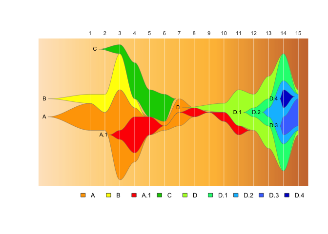

<!-- README.md is generated from README.Rmd. Please edit that file -->

# epifish

<!-- badges: start -->

<!-- badges: end -->

This package provides tools to use Chris Miller’s fishplot package
(<https://github.com/chrisamiller/fishplot>) with epidemiological
datasets, to generate fishplot epi-curves.

**Why?**

A fishplot is variety of
[streamgraph](https://www.data-to-viz.com/graph/streamgraph.html), which
is designed specifically for categorical data where where individual
categories can mutate to form subcategories. Originally designed for
[plotting evolution of tumor cell
lineages,](https://bmcgenomics.biomedcentral.com/articles/10.1186/s12864-016-3195-z)
we have found fishplots especially useful for illustrating the rise and
fall of genomic clusters in disease outbreaks, which can have a similar
evolutionary pattern.

However, a count matrix for a fishplot has a set of specific rules which
an epidemiological dataset will not naturally fulfill:

  - cluster counts per timepoint can never go completely to zero, if
    cases reappear later
  - if a cluster has a parent/child relationship, at every timepoint the
    parent must always have \>= the count of all its children.
  - counts should be normalised to fit the fishplot y-axis

This package exists to make it easy to convert a list of samples in an
epidemological dataset into a normalised and appropriately “padded”
relative count matrix that fulfils these requirements.

## Contents

  - [Installation](#installation)
  - [Quick start](#quick-start)
  - [Basic demo](#basic-demo)
  - [Input format](#input-format)
  - [Output](#output)
  - [Extras](#extras)
      - [Using raw dates to create
        timepoints](#using-raw-dates-to-create-timepoints)
          - [Calculate epi weeks and text
            labels](#calculate-epi-weeks-and-text-labels)
          - [Use epi months as
            timepoints](#use-epi-months-as-timepoints)
      - [Using informative timepoint
        labels](#using-informative-timepoint-labels)
      - [Manual timepoints and labels](#manual-timepoints-and-labels)
      - [Control legend spacing](#control-legend-spacing)
  - [Citation](#citation)
  - [Acknowledgements](#acknowledgements)

## Installation

You can install epifish with:

``` r
#install devtools if you don't have it already
install.packages("devtools")

#then load devtools & install epifish
library(devtools)
devtools::install_github("learithe/epifish")
```

## Quick Start

To get started with a basic epi fishplot, given an input file in the
right format (details below), this is all you need:

``` r
# load required libraries
library(fishplot); library(dplyr); library(tidyr); library(lubridate); library(epifish)

# read data file
sample_df <- read.csv("inst/extdata/samples.csv", stringsAsFactors=FALSE)

# run epifish 
epifish_output <- epifish::build_epifish( sample_df )

# run fishplot on the epifish output
fishplot::fishPlot( epifish_output$fish, shape="spline" )  
```


**If you want to include evolutionary relationships with subclusters:**

``` r
# load required libraries
library(fishplot); library(dplyr); library(tidyr); library(lubridate); library(epifish)

# read data files
sample_df <- read.csv("inst/extdata/samples.csv", stringsAsFactors=FALSE)
parent_df <- read.csv("inst/extdata/parents.csv", stringsAsFactors=FALSE)

# run epifish 
epifish_output <- epifish::build_epifish( sample_df, parent_df )

# run fishplot on the epifish output
fishplot::fishPlot( epifish_output$fish, shape="spline" )  
```


## Quick demo

*This demo expands on the quick-start example. It runs on a set of
example data that is present within the epifish package, the files can
be accessed here, in the
[`inst/extdata`](https://github.com/learithe/epifish/tree/main/inst/extdata)
directory.* <br><br>

Load epifish and required
packages

``` r
library(fishplot); library(dplyr); library(tidyr); library(lubridate); library(epifish)
```

Read in the tables of sample data, cluster parent-child relationships,
and custom colour
scheme:

``` r
sample_df <- read.csv("inst/extdata/samples.csv", stringsAsFactors=FALSE)
parent_df <- read.csv("inst/extdata/parents.csv", stringsAsFactors=FALSE)
colour_df <- read.csv("inst/extdata/colours.csv", stringsAsFactors=FALSE)
```

Use epifish to convert this into a fishplot object, with extra assorted
summary
information:

``` r
epifish_output <- epifish::build_epifish( sample_df, parent_df=parent_df, colour_df=colour_df)
#> setting parent position of child A.1  to  1 
#> setting parent position of child D.3  to  7 
#> setting parent position of child D.2  to  6 
#> setting parent position of child D.1  to  5 
#> setting parent position of child D.4  to  7 
#> Padding parent values in matrix: 
#> adding child  D.4  to parent  D.2 
#> adding child  D.3  to parent  D.2 
#> adding child  D.2  to parent  D.1 
#> adding child  D.1  to parent  D 
#> adding child  A.1  to parent  A 
#> The maximum sample count per timepoint (height of Y-axis) is:  15
```

Then use the fishplot package to generate a fishplot:

``` r
fishplot::fishPlot(epifish_output$fish, pad.left=0.1, shape="spline", 
                   vlines=epifish_output$timepoints, vlab=epifish_output$timepoints)
fishplot::drawLegend(epifish_output$fish, nrow=1)
```


If you’re happy with the default colours, or all your clusters are
independent, you don’t need those dataframes:

``` r
epifish_output <- epifish::build_epifish( sample_df )
#> The maximum sample count per timepoint (height of Y-axis) is:  15

fishplot::fishPlot(epifish_output$fish, pad.left=0.1, shape="spline", 
                   vlines=epifish_output$timepoints, vlab=epifish_output$timepoints)
fishplot::drawLegend(epifish_output$fish, nrow=1)
```


You also can automatically collapse any clusters of a minimum size into
a group with `min_cluster_size`:  
*Note: this currently does not work well with parent/child relationships
if any child clusters are
small\!*

``` r
epifish_output <- epifish::build_epifish(sample_df, colour_df=colour_df, min_cluster_size=10)
#> Warning in set_fish_colours(colour_df, fishplot_names): 
#> WARNING: existing clusters not found in colour list, setting these to white: clusters < 10
#> Warning in set_fish_colours(colour_df, fishplot_names): 
#> WARNING: some clusters in colour list not found in data: B, D.1, D.2, D.3, D.4
#> The maximum sample count per timepoint (height of Y-axis) is:  15

fishplot::fishPlot(epifish_output$fish, pad.left=0.1, shape="spline", vlines=epifish_output$timepoints, vlab=epifish_output$timepoints)
fishplot::drawLegend(epifish_output$fish, nrow=1)
```



## Input format

Example input files/templates can be found in the `inst/extdata` folder
in this repository. The basic requirement is a data frame containing one
row per sample, with columns `cluster_id` and `timepoint` (any other
columns are ignored). Optionally, the `timepoint` column can be
calculated using epifish from a column of dates (see below).

Optional data frames may also be provided that describe parent-child
relationships for clusters (eg cluster A.1 evolved from cluster A), or a
custom colour scheme.

It is easiest and safest (especially when working with dates) to save
and maintain these tables in `.csv` (comma-separated values) format, and
to read them into R using `read.csv("filename", stringsAsFactors=FALSE)`
as shown in the example above. However you can use whatever methods you
want to create these dataframes, as long as they contain the required
columns in character or numeric (NOT factor) format.

**the last few rows of sample data:**  
(Note that the order doesn’t matter)

<table>

<thead>

<tr>

<th style="text-align:right;">

case\_id

</th>

<th style="text-align:left;">

cluster\_id

</th>

<th style="text-align:left;">

date\_of\_collection

</th>

<th style="text-align:right;">

timepoint

</th>

</tr>

</thead>

<tbody>

<tr>

<td style="text-align:right;">

80

</td>

<td style="text-align:left;">

D.3

</td>

<td style="text-align:left;">

9/4/2020

</td>

<td style="text-align:right;">

15

</td>

</tr>

<tr>

<td style="text-align:right;">

81

</td>

<td style="text-align:left;">

D.4

</td>

<td style="text-align:left;">

2/4/2020

</td>

<td style="text-align:right;">

14

</td>

</tr>

<tr>

<td style="text-align:right;">

82

</td>

<td style="text-align:left;">

D.4

</td>

<td style="text-align:left;">

2/4/2020

</td>

<td style="text-align:right;">

14

</td>

</tr>

<tr>

<td style="text-align:right;">

83

</td>

<td style="text-align:left;">

D.3

</td>

<td style="text-align:left;">

3/4/2020

</td>

<td style="text-align:right;">

14

</td>

</tr>

<tr>

<td style="text-align:right;">

85

</td>

<td style="text-align:left;">

D.3

</td>

<td style="text-align:left;">

3/4/2020

</td>

<td style="text-align:right;">

14

</td>

</tr>

<tr>

<td style="text-align:right;">

84

</td>

<td style="text-align:left;">

A.1

</td>

<td style="text-align:left;">

22/1/2020

</td>

<td style="text-align:right;">

4

</td>

</tr>

</tbody>

</table>

**the parent-child data:**

<table>

<thead>

<tr>

<th style="text-align:left;">

cluster

</th>

<th style="text-align:left;">

parent

</th>

</tr>

</thead>

<tbody>

<tr>

<td style="text-align:left;">

A

</td>

<td style="text-align:left;">

</td>

</tr>

<tr>

<td style="text-align:left;">

A.1

</td>

<td style="text-align:left;">

A

</td>

</tr>

<tr>

<td style="text-align:left;">

B

</td>

<td style="text-align:left;">

</td>

</tr>

<tr>

<td style="text-align:left;">

C

</td>

<td style="text-align:left;">

</td>

</tr>

<tr>

<td style="text-align:left;">

D

</td>

<td style="text-align:left;">

</td>

</tr>

<tr>

<td style="text-align:left;">

D.3

</td>

<td style="text-align:left;">

D.2

</td>

</tr>

<tr>

<td style="text-align:left;">

D.2

</td>

<td style="text-align:left;">

D.1

</td>

</tr>

<tr>

<td style="text-align:left;">

D.1

</td>

<td style="text-align:left;">

D

</td>

</tr>

<tr>

<td style="text-align:left;">

D.4

</td>

<td style="text-align:left;">

D.2

</td>

</tr>

</tbody>

</table>

**a custom colour scheme:**  
(Note that you can use [named ggplot
colours](https://www.nceas.ucsb.edu/sites/default/files/2020-04/colorPaletteCheatsheet.pdf)
or hex codes (eg “red” or “\#ff0000”) )

<table>

<thead>

<tr>

<th style="text-align:left;">

cluster

</th>

<th style="text-align:left;">

colour

</th>

</tr>

</thead>

<tbody>

<tr>

<td style="text-align:left;">

A

</td>

<td style="text-align:left;">

orange

</td>

</tr>

<tr>

<td style="text-align:left;">

A.1

</td>

<td style="text-align:left;">

red

</td>

</tr>

<tr>

<td style="text-align:left;">

B

</td>

<td style="text-align:left;">

yellow

</td>

</tr>

<tr>

<td style="text-align:left;">

C

</td>

<td style="text-align:left;">

green3

</td>

</tr>

<tr>

<td style="text-align:left;">

D

</td>

<td style="text-align:left;">

greenyellow

</td>

</tr>

<tr>

<td style="text-align:left;">

D.1

</td>

<td style="text-align:left;">

springgreen

</td>

</tr>

<tr>

<td style="text-align:left;">

D.2

</td>

<td style="text-align:left;">

deepskyblue

</td>

</tr>

<tr>

<td style="text-align:left;">

D.3

</td>

<td style="text-align:left;">

royalblue1

</td>

</tr>

<tr>

<td style="text-align:left;">

D.4

</td>

<td style="text-align:left;">

blue3

</td>

</tr>

</tbody>

</table>

## Output

The output of epifish is a list variable (named `epifish_output` here)
containing: a fishplot object (`epifish_output$fish`), the data
structures needed to generate it, and some extra data summary tables:

  - `fish` fishplot object to pass to `fishplot::fishPlot()`
  - `timepoint_counts` summary table of number of samples per cluster
    per timepoint
  - `timepoint_sums` summary table of number of samples per timepoint
  - `cluster_sums` summary table of total number of samples per cluster
  - `timepoints` vector of timepoints used
  - `timepoint_labels` vector of the names of timepoints assigned in the
    plot
  - `parents` named list matching child clusters to their parent’s
    position in the matrix (0 means cluster is independent)
  - `raw_table` initial table of counts per cluster per timepoint,
    before padding and normalisation
  - `fish_table` normalised and parent-padded table for the epi-fishplot
  - `fish_matrix` final transformed matrix used to make the epifish
    object

The epifish fishplot object output `epifish_output$fish` is used with
the fishplot package’s `fishPlot()` function to generate an R plot
image, as shown above. If using RStudio, it is most straightforward to
save the R plot as PDF image from the RStudio plot window (Export -\>
“Save as PDF”).

If you wish to save individual tables from the epifish output list for
any reason, it can be done like
so:

``` r
write.csv(epifish_output$fish_table, "epifishplot_table.csv", row.names=FALSE)
```

This is the extra summary data that epifish creates:

``` r
epifish_output$timepoint_counts
#> # A tibble: 34 x 3
#> # Groups:   timepoint [14]
#>    timepoint FPCluster     n
#>        <int> <chr>     <int>
#>  1         1 A             3
#>  2         1 B             1
#>  3         2 A             2
#>  4         2 B             2
#>  5         3 A             9
#>  6         3 A.1           1
#>  7         3 B             4
#>  8         3 C             1
#>  9         4 A             2
#> 10         4 A.1           4
#> # … with 24 more rows

epifish_output$timepoint_sums
#> # A tibble: 14 x 2
#>    timepoint     n
#>        <int> <int>
#>  1         1     4
#>  2         2     4
#>  3         3    15
#>  4         4    11
#>  5         5     5
#>  6         6     4
#>  7         7     3
#>  8         8     1
#>  9        10     2
#> 10        11     5
#> 11        12     4
#> 12        13     8
#> 13        14    13
#> 14        15     5

epifish_output$cluster_sums
#> # A tibble: 9 x 2
#>   FPCluster     n
#>   <chr>     <int>
#> 1 A             6
#> 2 A.1           6
#> 3 B             4
#> 4 C             4
#> 5 D             5
#> 6 D.1           3
#> 7 D.2           3
#> 8 D.3           2
#> 9 D.4           1

epifish_output$parents
#>   A   B A.1   C   D D.1 D.2 D.3 D.4 
#>   0   0   1   0   0   5   6   7   7

epifish_output$timepoints
#>  1  2  3  4  5  6  7  8 10 11 12 13 14 15 
#>  1  2  3  4  5  6  7  8 10 11 12 13 14 15

epifish_output$timepoint_labels
#>  [1] "1"  "2"  "3"  "4"  "5"  "6"  "7"  "8"  "10" "11" "12" "13" "14" "15"

epifish_output$raw_table
#>    A B A.1 C D D.1 D.2 D.3 D.4
#> 1  3 1   0 0 0   0   0   0   0
#> 2  2 2   0 0 0   0   0   0   0
#> 3  9 4   1 1 0   0   0   0   0
#> 4  2 1   4 4 0   0   0   0   0
#> 5  0 0   2 3 0   0   0   0   0
#> 6  1 0   0 3 0   0   0   0   0
#> 7  3 0   0 0 0   0   0   0   0
#> 8  0 0   1 0 0   0   0   0   0
#> 10 0 0   1 0 1   0   0   0   0
#> 11 0 0   1 0 4   0   0   0   0
#> 12 0 0   0 0 3   1   0   0   0
#> 13 0 0   0 0 5   2   1   0   0
#> 14 0 0   0 0 0   6   3   2   2
#> 15 0 0   0 0 1   0   1   3   0

epifish_output$fish_table
#>          A     B     A.1     C       D   D.1   D.2   D.3   D.4
#> 1  19.7700  6.59  0.0000  0.00  0.0000  0.00  0.00  0.00  0.00
#> 2  13.1800 13.18  0.0000  0.00  0.0000  0.00  0.00  0.00  0.00
#> 3  65.9000 26.36  6.5900  6.59  0.0000  0.00  0.00  0.00  0.00
#> 4  39.5400  6.59 26.3600 26.36  0.0000  0.00  0.00  0.00  0.00
#> 5  13.1801  0.00 13.1800 19.77  0.0000  0.00  0.00  0.00  0.00
#> 6   6.5901  0.00  0.0001 19.77  0.0000  0.00  0.00  0.00  0.00
#> 7  19.7701  0.00  0.0001  0.00  0.0000  0.00  0.00  0.00  0.00
#> 8   6.5900  0.00  6.5900  0.00  0.0000  0.00  0.00  0.00  0.00
#> 10  6.5900  0.00  6.5900  0.00  6.5900  0.00  0.00  0.00  0.00
#> 11  6.5900  0.00  6.5900  0.00 26.3600  0.00  0.00  0.00  0.00
#> 12  0.0000  0.00  0.0000  0.00 26.3600  6.59  0.00  0.00  0.00
#> 13  0.0000  0.00  0.0000  0.00 52.7200 19.77  6.59  0.00  0.00
#> 14  0.0000  0.00  0.0000  0.00 85.6701 85.67 46.13 13.18 13.18
#> 15  0.0000  0.00  0.0000  0.00 32.9500 26.36 26.36 19.77  0.00

#this is the final matrix used to generate the epifish fishplot object
epifish_output$fish_matrix
#>           1     2     3     4       5       6       7    8   10    11
#>  [1,] 19.77 13.18 65.90 39.54 13.1801  6.5901 19.7701 6.59 6.59  6.59
#>  [2,]  6.59 13.18 26.36  6.59  0.0000  0.0000  0.0000 0.00 0.00  0.00
#>  [3,]  0.00  0.00  6.59 26.36 13.1800  0.0001  0.0001 6.59 6.59  6.59
#>  [4,]  0.00  0.00  6.59 26.36 19.7700 19.7700  0.0000 0.00 0.00  0.00
#>  [5,]  0.00  0.00  0.00  0.00  0.0000  0.0000  0.0000 0.00 6.59 26.36
#>  [6,]  0.00  0.00  0.00  0.00  0.0000  0.0000  0.0000 0.00 0.00  0.00
#>  [7,]  0.00  0.00  0.00  0.00  0.0000  0.0000  0.0000 0.00 0.00  0.00
#>  [8,]  0.00  0.00  0.00  0.00  0.0000  0.0000  0.0000 0.00 0.00  0.00
#>  [9,]  0.00  0.00  0.00  0.00  0.0000  0.0000  0.0000 0.00 0.00  0.00
#>          12    13      14    15
#>  [1,]  0.00  0.00  0.0000  0.00
#>  [2,]  0.00  0.00  0.0000  0.00
#>  [3,]  0.00  0.00  0.0000  0.00
#>  [4,]  0.00  0.00  0.0000  0.00
#>  [5,] 26.36 52.72 85.6701 32.95
#>  [6,]  6.59 19.77 85.6700 26.36
#>  [7,]  0.00  6.59 46.1300 26.36
#>  [8,]  0.00  0.00 13.1800 19.77
#>  [9,]  0.00  0.00 13.1800  0.00
```

## Extras

### Using raw dates to create timepoints

Epifish also has a few functions to make it easy to convert dates to
epidemic weeks or months (to use as timepoints), and generate
label-friendly versions of timepoint dates.

*NOTE: when working with dates in both R and Excel, be sure to check
that your values match what you expect\! When using R for analysis it is
best practice to save your data files in a text-based format like `.csv`
(comma-separated-value) format rather than Excel format, because [Excel
has many issues with how it handles
dates](https://datacarpentry.org/spreadsheets-socialsci/03-dates-as-data/),
and using a text-only format avoids having your dates messed up by
Excel.*

#### Calculate epi weeks and text labels

Given a date column name (`date_of_collection` here), the start date of
the epidemic, and the date format, you can use `get_epiweek()` to
calculate the number of weeks since the start of the epidemic each
sample belongs to, and `get_epiweek_span()` to give the epi week a clear
text label. *Note: these functions have customisation options, check
their documentation for
details.*

``` r
#calculate epiweek timepoints from the column "date_of_collection" & create text labels to match them
sample_df <- sample_df %>% rowwise() %>% 
             mutate("epiweek"= epifish::get_epiweek(cdate = date_of_collection, 
                                                    start_date = "1/1/20", 
                                                    date_format = "dmy"))

#create a timepoint label column that gives the last day of each epi week the sample was collected in:
sample_df <- sample_df %>% rowwise() %>% 
             mutate("epiweek_label"= epifish::get_epiweek_span(cdate = date_of_collection, 
                                                               date_format = "dmy",
                                                               return_end = TRUE, 
                                                               newline=TRUE))
```

``` r
#look at what we created 
tail(sample_df)
```

<table>

<thead>

<tr>

<th style="text-align:right;">

case\_id

</th>

<th style="text-align:left;">

cluster\_id

</th>

<th style="text-align:left;">

date\_of\_collection

</th>

<th style="text-align:right;">

timepoint

</th>

<th style="text-align:right;">

epiweek

</th>

<th style="text-align:left;">

epiweek\_label

</th>

</tr>

</thead>

<tbody>

<tr>

<td style="text-align:right;">

80

</td>

<td style="text-align:left;">

D.3

</td>

<td style="text-align:left;">

9/4/2020

</td>

<td style="text-align:right;">

15

</td>

<td style="text-align:right;">

15

</td>

<td style="text-align:left;">

11 Apr

</td>

</tr>

<tr>

<td style="text-align:right;">

81

</td>

<td style="text-align:left;">

D.4

</td>

<td style="text-align:left;">

2/4/2020

</td>

<td style="text-align:right;">

14

</td>

<td style="text-align:right;">

14

</td>

<td style="text-align:left;">

4 Apr

</td>

</tr>

<tr>

<td style="text-align:right;">

82

</td>

<td style="text-align:left;">

D.4

</td>

<td style="text-align:left;">

2/4/2020

</td>

<td style="text-align:right;">

14

</td>

<td style="text-align:right;">

14

</td>

<td style="text-align:left;">

4 Apr

</td>

</tr>

<tr>

<td style="text-align:right;">

83

</td>

<td style="text-align:left;">

D.3

</td>

<td style="text-align:left;">

3/4/2020

</td>

<td style="text-align:right;">

14

</td>

<td style="text-align:right;">

14

</td>

<td style="text-align:left;">

4 Apr

</td>

</tr>

<tr>

<td style="text-align:right;">

85

</td>

<td style="text-align:left;">

D.3

</td>

<td style="text-align:left;">

3/4/2020

</td>

<td style="text-align:right;">

14

</td>

<td style="text-align:right;">

14

</td>

<td style="text-align:left;">

4 Apr

</td>

</tr>

<tr>

<td style="text-align:right;">

84

</td>

<td style="text-align:left;">

A.1

</td>

<td style="text-align:left;">

22/1/2020

</td>

<td style="text-align:right;">

4

</td>

<td style="text-align:right;">

4

</td>

<td style="text-align:left;">

25 Jan

</td>

</tr>

</tbody>

</table>

### Using informative timepoint labels

If you call `build_epifish ()` with `timepoint_labels=TRUE`, epifish
will look for a column called `timepoint_label` to use as the timepoint
labels. (You can also set this up as a column in your input file, rather
than calculating it as shown here.) *Note: you can only have one unique
label per timepoint
value.*

#### Use calculated epi weeks as the timepoints

``` r
#fill the "timepoint" and "timepoint_label" columns with our newly calculated epi weeks above
sample_df$timepoint <- sample_df$epiweek  
sample_df$timepoint_label <- sample_df$epiweek_label

#tell epifish to use the "timepoint_label" column we just created
epifish_output <- epifish::build_epifish( sample_df, parent_df, colour_df, timepoint_labels=TRUE)
#> setting parent position of child A.1  to  1 
#> setting parent position of child D.3  to  7 
#> setting parent position of child D.2  to  6 
#> setting parent position of child D.1  to  5 
#> setting parent position of child D.4  to  7 
#> Padding parent values in matrix: 
#> adding child  D.4  to parent  D.2 
#> adding child  D.3  to parent  D.2 
#> adding child  D.2  to parent  D.1 
#> adding child  D.1  to parent  D 
#> adding child  A.1  to parent  A 
#> The maximum sample count per timepoint (height of Y-axis) is:  15

fishplot::fishPlot(epifish_output$fish, pad.left=0.1, shape="spline", 
                   vlines=epifish_output$timepoints, vlab=epifish_output$timepoint_labels)
fishplot::drawLegend(epifish_output$fish, nrow=1)
```


#### Use epi months as timepoints:

Epifish also has `get_epimonth()` and `get_month_text()` functions for
calculating epi months from dates:

``` r

#create a "epimonth" timepoint:
sample_df <- sample_df %>% rowwise() %>% 
             mutate("timepoint"= epifish::get_epimonth(cdate = date_of_collection, 
                                                      start_date = "1/1/20", 
                                                      date_format = "dmy")) 
#and an epimonth label
sample_df <- sample_df %>% rowwise() %>% 
             mutate("timepoint_label"= epifish::get_month_text(cdate = date_of_collection, 
                                                              date_format = "dmy")) 

#tell epifish to use the "timepoint_label" column we created above
epifish_output <- epifish::build_epifish( sample_df, parent_df, colour_df, timepoint_labels=TRUE)
#> setting parent position of child A.1  to  1 
#> setting parent position of child D.3  to  7 
#> setting parent position of child D.2  to  6 
#> setting parent position of child D.1  to  5 
#> setting parent position of child D.4  to  7 
#> Padding parent values in matrix: 
#> adding child  D.4  to parent  D.2 
#> adding child  D.3  to parent  D.2 
#> adding child  D.2  to parent  D.1 
#> adding child  D.1  to parent  D 
#> adding child  A.1  to parent  A 
#> The maximum sample count per timepoint (height of Y-axis) is:  38

#use "polygon" shape here as "spline" and "bezier" have some issues...
fishplot::fishPlot(epifish_output$fish, pad.left=0.1, shape="polygon", 
                   vlines=epifish_output$timepoints, vlab=epifish_output$timepoint_labels)
fishplot::drawLegend(epifish_output$fish, nrow=1, xpos=0.7)
```


### Manual timepoints and labels

The fishplot package provides flexibility in where to display the
vertical lines and what text to show, which can be used to create custom
combinations rather than using the epifish default:

You can plot every other week:

``` r
#calculate use the epiweek timepoints
sample_df$timepoint <- sample_df$epiweek
sample_df$timepoint_label <- sample_df$epiweek_label

#run epifish
epifish_output <- epifish::build_epifish( sample_df, parent_df, colour_df, timepoint_labels=TRUE)
#> setting parent position of child A.1  to  1 
#> setting parent position of child D.3  to  7 
#> setting parent position of child D.2  to  6 
#> setting parent position of child D.1  to  5 
#> setting parent position of child D.4  to  7 
#> Padding parent values in matrix: 
#> adding child  D.4  to parent  D.2 
#> adding child  D.3  to parent  D.2 
#> adding child  D.2  to parent  D.1 
#> adding child  D.1  to parent  D 
#> adding child  A.1  to parent  A 
#> The maximum sample count per timepoint (height of Y-axis) is:  15

#subset timepoints and labels to ever other entry
vlines <- epifish_output$timepoints[c(TRUE, FALSE)]
vlabs  <- epifish_output$timepoint_labels[c(TRUE, FALSE)]

#plot
fishplot::fishPlot(epifish_output$fish, pad.left=0.1, shape="spline", 
                   vlines=vlines, vlab=vlabs)
```


Or add a “zero” timepoint with the first case, which starts on the
fourth day of the first epi week (we’ll also make the text a bit smaller
so it doesn’t overlap):

``` r
vlines <- c((4/7), epifish_output$timepoints)
vlabs <- c("1\nJan", epifish_output$timepoint_labels)

fishplot::fishPlot(epifish_output$fish, pad.left=0.1, shape="spline", 
                   vlines=vlines, vlab=vlabs, cex.vlab=0.5)
```


Or we can use completely custom timepoints and labels that describe an
epidemiological story, with red lines:

``` r
vlines <- c((4/7), 3, 4, 8, 14)
vlabs <- c("first\ncases", "peak 1", "quarantine\n", "quarantine\nlifted", "peak 2")

fishplot::fishPlot(epifish_output$fish, pad.left=0.1, shape="spline", 
                   vlines=vlines, vlab=vlabs, col.vline="red")
```


### Control legend spacing

You can use `epifish::drawLegend2()` to modify the spacing of the
epi-fishplot legend, which is especially useful with long cluster names.
Use `widthratio` to adjust the width between columns relative to the
longest cluster name (smaller value = more space), and `xsp` to control
space between the colour box and the text (larger = more space)

**default
`fishplot::drawLegend()`:**

``` r
fishplot::fishPlot(epifish_output$fish, pad.left=0.1, shape="spline", vlines=epifish_output$timepoints, vlab=epifish_output$timepoint_labels)
fishplot::drawLegend(epifish_output$fish, nrow=2)
```


**using `epifish::drawLegend2()` to adjust the legend
spacing:**

``` r
fishplot::fishPlot(epifish_output$fish, pad.left=0.1, shape="spline", vlines=epifish_output$timepoints, vlab=epifish_output$timepoint_labels)
epifish::drawLegend2(epifish_output$fish, nrow=2, widthratio=0.3, xsp=0.2)
```


## Citation:

**If you use epifish in your work, please cite:**

  - **epifish**: this github page.
  - **fishplot**: Visualizing tumor evolution with the fishplot package
    for R. Miller CA, McMichael J, Dang HX, Maher CA, Ding L, Ley TJ,
    Mardis ER, Wilson RK. BMC Genomics. <doi:10.1186/s12864-016-3195-z>

## Acknowledgements:

This work extends the Chris Miller’s fishplot package
(<https://github.com/chrisamiller/fishplot>). It was written by
Dr. Jenny Draper as an employee of [New South Wales Health
Pathology](https://www.pathology.health.nsw.gov.au), at the Westmead
Hospital Institute of Clinical Pathology & Medical Research (ICPMR)
[Centre for Infectious Diseases and Microbiology - Public
Health](https://www.wslhd.health.nsw.gov.au/Education-Portal/Research/Research-Categories/Centre-for-Infectious-Diseases-and-Microbiology-Public-Health/About-CIDMPH)
in Australia. `epifish` was initially developed to track genomic
clusters during the NSW government’s response to COVID-19.
